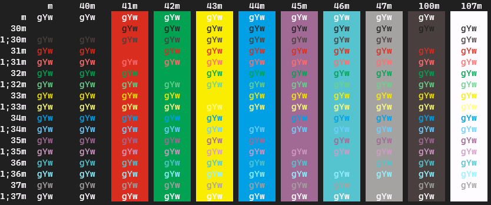
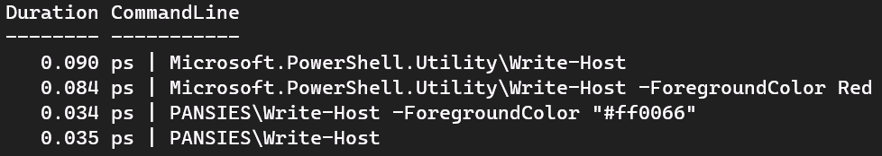

# PANSIES
## A Primer on ANSI Escape Sequences

<link rel="stylesheet" href="https://highlightjs.org/static/demo/styles/atelier-lakeside-dark.css" />

<!-- .slide: data-background-position="center center" data-background="./images/pansies.jpg" data-background-opacity=".5"  data-background-color="#000000"  -->
---

## A Little About Me

Joel "Jaykul" Bennett

12x PowerShell MVP

Principal DevOps Engineer at loanDepot

---

### ANSI Escape Sequences
- AKA [Virtual Terminal Sequences](https://docs.microsoft.com/en-us/windows/console/console-virtual-terminal-sequences)
- AKA [Control Sequences](https://invisible-island.net/xterm/ctlseqs/ctlseqs.html)

> Character sequences for color, cursor movement, character modes, text modification, and other operations.

note:
Sequences may also be received on the input stream in response to an output stream query information sequence or as an encoding of user input when the appropriate mode is set.

---

### Historical Notes:

ANSI X3.4 is also known as US-ASCII

128 characters, and their 7-bit encoding

The first spec leading to ECMA, ISO and Unicode

note:
"American National Standard for Information Systems – Coded Character Sets – 7-Bit American National Standard Code for Information Interchange."

--

#### American National Standards Institute

The "X3" in ANSI X3.4 refers to the sponsoring committee: the Accredited Standards Committee X3, Information Technology, which is now the:

##### InterNational Committee for Information Technology Standards

--

### Evolving Standards

- 7-bit ANSI X3.4 (is now [INCITS 4](https://webstore.ansi.org/Standards/INCITS/INCITS1986R2017))</br>
Is also [ECMA-6](https://www.ecma-international.org/publications-and-standards/standards/ecma-6/) and [ISO 646](https://en.wikipedia.org/wiki/ISO/IEC_646)
- Is succeeded by [ECMA-43](https://www.ecma-international.org/publications-and-standards/standards/ecma-43/) & [94](https://www.ecma-international.org/publications-and-standards/standards/ecma-94/) and [ISO 8859](https://en.wikipedia.org/wiki/ISO/IEC_8859)
- Is succeeded by UTF-8
in [ISO 10646](https://en.wikipedia.org/wiki/ISO/IEC_10646) (Unicode)

note:
ISO 646 (ECMA-6) was the 7-bit encoding
ISO 8859 (ECMA-43) is a 8-bit encoding
ISO 10646 includes 16-bit and even 32-bit encodings

--

### Digital Equipment Company

DEC made **ANSI-compatible** video terminals like the 7-bit VT100

Proprietary control sequences known as ANSI escape sequences because they start with an ANSI escape character (ESC) -- encoded as 27 `0x1B`.

Eventually, ANSI and ECMA created [ECMA-48](https://www.ecma-international.org/publications-and-standards/standards/ecma-48/) in 1976 -- it's now also [ISO/IEC 6429](https://en.wikipedia.org/wiki/ISO/IEC_6429)

Only matters because [XTerm implements it](https://invisible-island.net/xterm/ctlseqs/ctlseqs.html)...

---

## Escape Sequences?

In 7-bit mode, they all start with ESC (⎋)

In 8-bit mode, you can use a few shortcuts:

ESC | VALUE | NAME
--- | ----- | ----
⎋P  | 0x90  | Device Control String
⎋[  | 0x9b  | Control Sequence Introducer
⎋\\ | 0x9c  | String Terminator
⎋]  | 0x9d  | Operating System Command

There are more [8-Bit Control Characters](https://invisible-island.net/xterm/ctlseqs/ctlseqs.html#h2-C1-_8-Bit_-Control-Characters)

... ... ...

---

# Show Me!
### What Can They Do?

---

## You asked for it:
#### DEC Line Drawing Mode

Drawing Mode: `` `e(0 ``</br>
Normal Mode: `` `e(B ``

```PowerShell
"`e(0
lqqqqqqqqqqk
x          x
x          x
mqqqqqqqqqqj
`e(B"
```
Or this:
```PowerShell
param( $Width  = 15, $Height = 7 )
"`e(0"
"l$("q"*$Width)k"
"x$(" "*$Width)x`n" * $Height +
"m$("q"*$Width)j"
"`e(B"
```

note: OK, that's not too exciting, but consider how much fun it would be to stick a `e(0 into your friend's profile on April 1st!

note: In addition to modes, we can position t

---

## Cursor Positioning

--

### Relative Movement
note: Within the viewport, no scrolling

CHAR | BEHAVIOR      | CHAR | BEHAVIOR
---- | --------      | ---- | --------
`⎋A` | Cursor Up     | `⎋B` | Cursor Down
`⎋C` | Cursor Right  | `⎋D` | Cursor Left
`⎋7` | Save Position | `⎋8` | Restore Position

These also work parameterized as:

`⎋[4A` -- to go up 4 times

--

### Absolute Positioning

Sequence | Result
-------- | ------
`⎋[4G`   | 4<sup>th</sup> column in the current line
`⎋[4d`   | 4<sup>th</sup> row in the current column
`⎋[2;4f` | 4<sup>th</sup> column in 2<sup>nd</sup> row


--

### A PowerShell Example

Now we can draw a box at a specific position:

$X=8$, $Y=3$, $Height=12$, $Width=50$


```PowerShell {data-line-numbers="4,8,11"}
$position = "`e[{0};{1}f"
-join @(
    "`e(0"
    $position -f $Top++, $Left
    "l" + ("q" * $Width) + "k"

    while ($Top -lt $Height) {
        $position -f $Top++, $Left
        "x" + (" " * $Width) + "x"
    }
    $position -f $Top++, $Left
    "m" + ("q" * $Width) + "j"
    "`e(B"
)
```

note: run this over the top of some output
note: don't you want to clear the screen?

---

## Editing Text

--

### Inserting & Deleting Text

Sequence | Result
-------- | ------
`⎋[4@`   | Insert 4 spaces, shifting text right
`⎋[4L`   | Insert 4 lines, pushing lines down
`⎋[4X`   | Erase 4 characters (with space)
`⎋[4P`   | Delete 4 characters, fill from right
`⎋[4M`   | Delete 4 lines (including this one)
`⎋[2J`   | Erase the whole display (0 ->, <- 1)
`⎋[0K`   | Erase the current line (0 ->, <- 1)

--

### Now we can clear:

We just add `⎋[2J` at the top:

```PowerShell {data-line-numbers="3"}
$position = "`e[{0};{1}f"
-join @(
    "`e[2J"
    "`e(0"
    $position -f $Top++, $Left
    "l" + ("q" * $Width) + "k"

    while ($Top -lt $Height) {
        $position -f $Top++, $Left
        "x" + (" " * $Width) + "x"
    }
    $position -f $Top++, $Left
    "m" + ("q" * $Width) + "j"
    "`e(B"
)
```

note: but I really want some color

---

## Can we talk color yet?

--

### Text Colors

Foreground: `⎋[3#m` (`⎋[9#m` bright)</br>
Background: `⎋[4#m` (`⎋[10#m` bright)

0 Black  | 4 Blue
1 Red    | 5 Magenta
2 Green  | 6 Cyan
3 Yellow | 7 White
- | -
8 Extended colors:</br>Full RGB values: `⎋[38;2;R;G;Bm`||
9 Default color resets the color ||

`⎋[0m` to reset all colors

note: ```
note: 38 ; 2 ; r ; g ; b    Set foreground color to RGB value specified in r, g, b parameters*
note: 48 ; 2 ; r ; g ; b    Set background color to RGB value specified in r, g, b parameters*
note: 38 ; 5 ; s            Set foreground color to s index in 88 or 256 color table*
note: 48 ; 5 ; s            Set background color to s index in 88 or 256 color table*
note: ```

--

### Text Formatting

`⎋[0m`  | Default
`⎋[1m`  | Bold (Bright)
- | -
`⎋[22m` | Remove Bold/Bright
`⎋[4m`  | Underline
`⎋[24m` | Remove Underline
`⎋[7m`  | Negative
`⎋[27m` | Remove Negative

--

### A PowerShell Example
Print a grid of the standard colors:


```powershell

foreach ($f in 0..7) {
    -join (0..7).ForEach{ "`e[4$_;3$f;2m  gYw  `e[40;30m " }
    -join (0..7).ForEach{ "`e[4$_;3$f;1m  gYw  `e[40;30m " }
}

```

--



---

## But wait, there's more

--

### Scrolling

Set the scrolling region:

`⎋[ top ; bottom r`

--

### Buffers

New alternate screen buffer:

`⎋[?1049h`

note: Can be called repeatedly

Return to main screen buffer:

`⎋[?1049l`

---

### Put it all together:


```PowerShell {data-line-numbers="2,14"}
$position = "`e[{0};{1}f"
"`e[?1049h`e[38;2;255;200;68m`e[48;2;200;79;104m`e(0"
-join @(
    $position -f $Top++, $Left
    "l" + ("q" * $Width) + "k"
    while ($Top -lt $Height) {
        $position -f $Top++, $Left
        "x" + (" " * $Width) + "x"
    }
    $position -f $Top++, $Left
    "m" + ("q" * $Width) + "j"
)
Read-Host "`e(B"
"`e[?1049l"
```

---

# PANSIES
## Just Demo It
### 6 Commands
### 1 Provider

--

## Write-Host

Obviously this clobbers the built-in `Write-Host` command. It's compatible, but faster:




It supports console colors by name, X11 colors by name or indexes, and web-style `#rrggbb` colors

note: which you may know as web-safe color names

note: Write-Host "Hello World" -ForegroundColor "#ff0066"

note: Write-Host "Hello World" -ForegroundColor "#ff0066" -BackgroundColor "Orange"

--

## Get-ColorWheel

Colors _looping_ from a starting color, like a rainbow

Useful for getting sets of unique colors

```PowerShell
Get-ColorWheel "#880033" -Count 10 -HueStep 10
```

```PowerShell
Get-ColorWheel "#880033" -Count 10 -HueStep 20 |
    Write-Host -BackgroundColor {$_} "   " -NoNewline
```

Rotates hue _and brightness_, by default:

```PowerShell
Get-ColorWheel "#880033" -Count 20 |
    Write-Host -BackgroundColor {$_} "   " -NoNewline
```

--

## Get-Gradient

A gradient between two colors:

```PowerShell
Get-Gradient Blue IndianRed -Count 5
```

By default, it's full-screen width:

```PowerShell
Get-Gradient Blue IndianRed |
    Write-Host " " -NoNewline -BackgroundColor { $_ }
```


```PowerShell
Get-Gradient Blue4 Yellow |
   Write-Host " " -NoNewline -BackgroundColor { $_ }
```


```PowerShell
$I = 0; $Text = " Hello World "
Get-Gradient Blue4 Yellow -Width $Text.Length |
    Write-Host { $Text[$global:i++] } -No -Bg { $_ }
```


--

## Get-Complement

Gets the hue-complement color

```PowerShell
Get-Complement Cyan
```
note: Returns Red (the complement for Cyan)

```PowerShell
Get-Complement Cyan -Passthru
```
note: Get the original color also with -Pasthru

```PowerShell
$I = 0; $Text = " Hello World "
Get-Gradient Blue4 Yellow -Width $Text.Length -Pv Bg |
    Get-Complement |
    Write-Host { $Text[$global:i++] } -No -Bg { $Bg } -Fg { $_ }
```

Option | Result
------ | ------
Normal | 
High Contrast | 
Black & White | 


note: ```PowerShell
$I = 0; $Text = " Hello World "
Get-Gradient Blue4 Yellow -Width $Text.Length -Pv Bg |
    Get-Complement -HighContrast |
    Write-Host { $Text[$global:i++] } -No -Bg { $Bg } -Fg { $_ }
note: ```

note: ```PowerShell
$I = 0; $Text = " Hello World "
Get-Gradient Blue4 Yellow -Width $Text.Length -Pv Bg |
    Get-Complement -BlackAndWhite |
    Write-Host { $Text[$global:i++] } -No -Bg { $Bg } -Fg { $_ }
note: ```

--

## New-Text

#### Supports `&entities;` and colors.
Outputs nestable rich objects you can modify and render later.

<div class="r-stack">

:::block {class="fragment fade-out" data-fragment-index="0"}
```PowerShell
"Your father was a hampster, and your mother smelled of elderberries." |
% { $(switch -regex (-split $_ | New-Text) {

"father" { $_.ForegroundColor = "DarkGreen" }
"mother" { $_.ForegroundColor = "DarkRed" }
"ther" { $_.BackgroundColor = "Wheat" }

"." { $_ }
}) -join " " }
```
:::

:::block {class="fragment" data-fragment-index="0"}

:::

</div>

---

```
a primer on ANSI escape sequences:
- what they are,
- what you can do with them,
- why they're the cross-platform answer to
  - building user interfaces
  - better user experiences at the command-line.

One of my favorite modules: PANSIES,
- how you can use it
- when you need it
some of the ways you can use it to colorize and beautify the output of your PowerShell scripts and modules, and
- demonstrate its use in a few modules to:
    - theme and color prompts
    - output
    - syntax highlighting
    - and more...
```